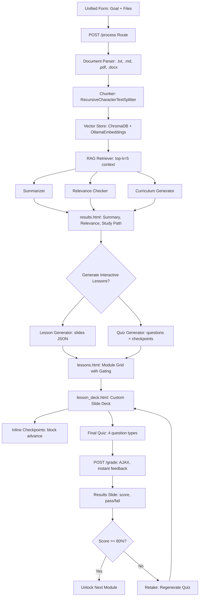

# Design and Testing Document
# Study-and-Learn

**Version:** 0.2  
**Status:** Living document  
**Last updated:** May 2026

---

## 1. Architecture Overview

Study-and-Learn is a Flask web application with a Bootstrap-and-retro-CSS frontend and an AI-assisted backend workflow.

Core workflow:

1. User enters a learning goal and uploads study documents in a single unified form.
2. Backend validates and stores uploads.
3. Document parser extracts text.
4. RAG pipeline chunks, embeds, stores, and retrieves relevant context.
5. AI services generate summary, relevance check, and study path.
6. Results page displays structured output with improved visual hierarchy.
7. User clicks "Generate Interactive Lessons" to produce slide-based lessons.
8. AI generates lesson slides + inline checkpoints + mixed-type quiz per module.
9. Custom CSS/JS slide deck presents lessons with retro fonts and checkpoint blocking.
10. Learner completes quiz, receives instant grading with per-question feedback.
11. Failed modules can be retaken with fresh regenerated questions.
12. Progression is gated (80% pass threshold required to unlock next module).

---

## 2. Architecture Decisions

### ADR-001: Use Flask for the MVP

**Decision:** Use Flask for backend development.

**Reason:** Flask is lightweight, Python-based, and suitable for a capstone-scale web application. It allows fast development without imposing a large framework structure.

### ADR-002: Use Bootstrap for the UI

**Decision:** Use Bootstrap 5 for UI styling.

**Reason:** Bootstrap provides responsive layout and common UI components with minimal custom CSS and no complex frontend build process.

### ADR-003: Avoid chat UI in the MVP

**Decision:** Use forms, buttons, and structured result pages.

**Reason:** The project goal is guided learning support, not open-ended chatbot interaction. This also makes the MVP easier to test and demonstrate.

### ADR-004: Use an AI client wrapper

**Decision:** AI calls should go through a service wrapper such as `ai_client.py`.

**Reason:** This makes the application easier to test by allowing mocked AI responses. It also allows Ollama or another model provider to be swapped later.

### ADR-005: Start with simple parsing before advanced retrieval

**Decision:** Implement document parsing and whole-document/section summarization first. Add embeddings/retrieval only after the core workflow works.

**Reason:** The capstone MVP depends on end-to-end functionality. Retrieval adds value but also complexity.

### ADR-006: Implement RAG Pipeline (Chunk → Embed → Retrieve → Generate)
**Decision:** Replace direct document-to-AI prompting with LangChain chunking + ChromaDB retrieval.
**Reason:** Prevents context window overflow, enables source-grounded outputs, scales to multiple documents, and aligns with modern AI engineering standards.
**Tradeoffs:** ✅ Grounded, scalable, traceable • ❌ Adds vector DB dependency, requires embedding strategy

### ADR-007: Use Single Configurable Ollama Model + Mock Fallback
**Decision:** All AI services call one model via `OLLAMA_MODEL` env var (default: `qwen3:1.7b`). CI/testing uses `AI_MOCK=true`.
**Reason:** Capstone MVP prioritizes reliability over model routing complexity. 1B–3B models run efficiently on target hardware. Mock fallback guarantees deterministic tests.

### ADR-008: Dual Ollama Model Strategy (Chat + Embeddings)
**Decision:** Chat uses `OLLAMA_MODEL` (default: qwen3:1.7b), Embeddings use `OLLAMA_EMBEDDING_MODEL` (default: qwen3-embedding:0.6b).
**Reason:** Chat models don't support /api/embed. Separation prevents 501 errors and allows independent tuning of generation vs retrieval models.

### ADR-009: Custom CSS/JS Slide Deck Engine (Replaces reveal.js)

**Decision:** Build a custom CSS/JS slide-deck engine instead of using reveal.js.

**Reason:** reveal.js introduced layout overflow bugs, scaling issues on the constrained viewport, and CSS conflicts with the project's retro theme (custom `@font-face` declarations, cyberpunk body styles). A custom engine gives full control over sizing, font application, checkpoint blocking logic, and responsive breakpoints. The custom engine renders slides from JSON, supports title/content/example/summary slide types, inline checkpoint blocking, and final quiz forms — all with Retrograde Bold and BoldPixels pixel fonts. This aligns with the "thin MVP" philosophy (build only what's needed) and avoids dependency bloat.

### ADR-010: Server-Side Session Storage with Flask-Session + cachelib

**Decision:** Use Flask-Session with cachelib's FileSystemCache for session storage.

**Reason:** Flask's default signed-cookie sessions cap at ~4 KB. Full lesson JSON for 5 modules with slides, checkpoints, and quiz questions far exceeds this limit. Flask-Session's server-side storage keeps the per-request cookie small while storing large session data on disk. FileSystemCache was chosen over the deprecated filesystem backend to match Flask-Session 0.8's recommended pattern. Tradeoffs: ✅ No cookie size limits, transparent to app code • ❌ Requires `data/flask_session/` directory, sessions lost on server restart (acceptable for MVP demo).

### ADR-011: Sequential Lesson Generation with Progress Feedback

**Decision:** Generate lessons sequentially (one module at a time) with a visible progress/loading indicator rather than concurrently.

**Reason:** Sequential execution is simpler to debug, logs clearly, avoids overwhelming the local Ollama server with concurrent requests on limited hardware (6GB VRAM), and enables accurate per-module progress reporting. Concurrency was considered but rejected due to: harder error handling, risk of Ollama request queuing and timeouts, and difficulty showing clean progress. The current full-screen loading spinner is a stepping stone; the next iteration will replace it with a background progress bar showing current stage.

### ADR-012: Retake = Regenerate Fresh Questions

**Decision:** On lesson retake, regenerate entirely new quiz questions and checkpoints rather than reusing the originals.

**Reason:** Reusing the same questions on retake allows learners to memorize answers without understanding the material — the worst pedagogical outcome. Regenerating questions each retake tests real comprehension and is pedagogically strongest. The tradeoff is additional Ollama calls and generation time per retake, but this is acceptable on a per-module basis (5 questions + ~2 checkpoints per retake, < 60 seconds each on qwen3:1.7b).

---

## 3. Software & Architectural Patterns
- Model-View-Controller (MVC): Flask routes (Controller) delegate to `app/services/` (Model/Business Logic) and render Bootstrap templates (View). Separation keeps routing thin and services testable.
- Service Layer Pattern: All AI, parsing, and RAG logic isolated in `app/services/`. Enables independent unit testing, easy mocking, and future provider swaps.
- Repository/DAO Pattern: ChromaDB vector storage abstracted behind `vector_store.py`. Decouples ingestion from retrieval logic.
- Mock Object Pattern: `AI_MOCK=true` and in-memory ChromaDB replace live LLM/vector calls in CI. Guarantees deterministic, zero-cost, GPU-free test execution.

---

## 3. Testing Strategy

### Unit Tests
    Unit tests cover isolated logic:
    - allowed file type validation,
    - parser selection,
    - parser error handling,
    - prompt construction,
    - relevance label parsing,
    - curriculum output parsing,
    - AI client mock mode and live mode,
    - LangChain text splitter output validation,
    - ChromaDB collection creation & persistence checks,
    - ChromaDB uses EphemeralClient when CI=true, PersistentClient otherwise,
    - Similarity search context builder accuracy,
    - Multi-file upload session & cookie size limits,
    - AI calls mocked via AI_MOCK=true,
    - Lesson generator: mock, empty inputs, retriever, slide validation, fallback behavior,
    - Quiz generator: mock, empty inputs, retriever, inline checkpoint, question validation, type mix distribution, fallback quiz structure,
    - Slide validation (only known types accepted),
    - Question validation (all 4 question types: mcq, true_false, multi_select, fill_blank),
    - Fallback lesson and quiz generation for error resilience.

### Integration Tests

Integration tests cover routes and workflow behavior:
- homepage loads,
- `/process` route with valid data returns results,
- `/process` route rejects empty goal,
- `/process` route rejects empty files,
- `/process` route rejects invalid file types,
- `/process` route enforces max 5 files,
- mocked full workflow: goal + upload → summary → relevance → study path,
- mocked generate-lessons flow: session data → lesson + quiz generation → redirect,
- lesson deck route with pre-populated session lessons returns 200.

Current test suite: **45 tests, 0 failures**.

### Smoke Tests

Smoke tests run before sprint demos and final recording:
- app starts,
- sample document uploads,
- summary displays with markdown rendering,
- relevance result displays with colored indicator,
- study path timeline displays,
- "Generate Interactive Lessons" button triggers generation,
- slide deck renders with retro fonts,
- checkpoints block advance until answered,
- quiz grading returns score and per-question feedback,
- retake regenerates questions,
- module gating enforces 80% pass progression.

---

## 4. CI/CD

Initial GitHub Actions workflow:

- trigger on push and pull request,
- install Python,
- install dependencies,
- run `pytest -v tests/`.

Future additions:
- linting,
- formatting,
- deployment automation,
- security scanning.

---

## 5. AI Tooling Use

AI tooling may be used to:
- refine specifications,
- draft code,
- generate test ideas,
- debug implementation issues,
- improve documentation.

All AI-generated code must be reviewed before commit. Important project behavior should be covered by tests.

---

## 6. Deployment Notes

Deployment target is undecided. Candidate platforms:
- Render,
- Railway,
- PythonAnywhere,
- DigitalOcean,
- AWS EC2.

The deployed version should be stable enough for capstone demonstration and accessible from the final submission link.

---

## 7. Deployment Strategy & Cost Analysis
- Option A: Local-First Demo (Current)
  - Host: Developer laptop running Ollama + Flask
  - Cost: $0 (uses existing hardware)
  - Tradeoff: Not publicly accessible; suitable for sprint demos & local dev
- Option B: Free-Tier Cloud (Recommended for Submission)
  - Host: Render or Railway (Flask web service)
  - Cost: $0/month (free tier supports 512MB–1GB RAM, sufficient for Flask + static assets)
  - AI Strategy: Swap Ollama for cloud API (OpenRouter/Groq) or keep `AI_MOCK=true` for demo
  - Vector DB: ChromaDB runs in-memory or uses persistent volume (~50MB free tier storage)
  - Tradeoff: Requires API key or mocked AI; free tier sleeps after inactivity but wakes on request
- Option C: VPS (DigitalOcean/AWS)
  - Cost: ~$6–12/month (4GB RAM droplet)
  - Tradeoff: Overkill for capstone; adds operational overhead
Recommendation: Deploy to Render/Railway free tier with `AI_MOCK=true` for grading, document swap path to production API in README.

---

## 8. Known Risks

| Risk | Impact | Mitigation |
|---|---|---|
| AI model too slow locally | Demo delay | Use small documents and cached/demo responses if needed |
| File parsing issues | Failed workflow | Start with fewer file types and add more gradually |
| Scope creep | Missed MVP | Keep optional features outside official sprint goals |
| Deployment resource limits | App unavailable | Test deployment early |
| AI output inconsistency | Poor demo | Use controlled sample documents and structured prompts |
| Quiz/lesson quality inadequate for learning | Poor pedagogical value | Prompt engineering research in Sprint 4; evaluate alternative models; set appropriate expectations for 1.7B model |
| Session data loss on server restart | Lost lesson state | Acceptable for MVP demo; document limitation; persistent storage deferred to v2 |
| Loading UX causes user abandonment | Dropped sessions during long generation | Replace full-screen overlay with background progress UI in Sprint 4 |
