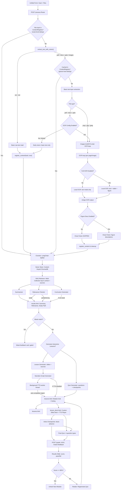

# Architecture

> **The source code is the source of truth.** This document is an orientation
> map only and may lag behind the code. For anything specific, read the code.
> No line-number references are maintained here by design.

---

## 1. Overview

Study-and-Learn is an AI-powered educational web application that transforms uploaded study materials (PDFs, DOCX, PPTX, images, and text) into structured, interactive learning pathways. Using a Retrieval-Augmented Generation (RAG) architecture, the system grounds generated lessons, quizzes, and summaries in the user's documents rather than the AI's general training data.

The application features a retro-cyberpunk themed custom slide-deck engine, inline comprehension checkpoints, opt-in neural text-to-speech (TTS) narration, and global content-addressable deduplication.

---

## 2. High-Level Architecture

The application follows a service-oriented web architecture that separates HTTP routing from complex AI and document-processing logic.

* **Frontend:** Bootstrap 5 paired with a custom CSS/JS retro-themed slide-deck engine.
* **Backend:** Flask (Python 3.13) utilizing a strict Service Layer and Repository pattern.
* **Data Layer:** PostgreSQL for relational data (users, study paths, progress) and ChromaDB (local or cloud) for vector storage.
* **AI Integration:** Configurable local (Ollama) or cloud-based LLMs for summarization, curriculum generation, and OCR. A deterministic mock mode guarantees reliable offline testing.

### Core Workflow
1. **Ingestion & Deduplication:** A user submits a learning goal and up to five files. The system computes SHA-256 hashes to bypass redundant processing for previously seen documents.
2. **Extraction & OCR:** Text is extracted via standard parsers. If documents are scanned or image-based, an AI-powered local OCR pipeline extracts text, tables, and figures.
3. **RAG Indexing:** Extracted text is chunked, embedded, and stored in content-addressed vector collections.
4. **AI Analysis:** The system generates a summary and performs a relevance check. Weak matches gate further generation to save compute and prevent hallucinations — relevance gating blocks lesson generation for documents that do not match the learning goal, avoiding hallucinated study paths.
5. **Lesson Generation:** For valid matches, the system sequentially generates slide decks, inline checkpoints, and mixed-type quizzes. Opt-in TTS narration is generated asynchronously in a background worker.
6. **Interactive Learning:** Learners navigate the custom slide deck. Progression is gated by an 80% pass threshold on final quizzes.

---

## 3. Architecture Diagram

The following diagram illustrates the end-to-end processing pipeline, highlighting deduplication logic, OCR gating, and asynchronous TTS processing.

---

## 4. Software & Architectural Patterns

* **Model-View-Controller (MVC):** Flask routes act as thin controllers, delegating business logic to service modules and rendering Jinja/Bootstrap views.
* **Service Layer Pattern:** All AI, parsing, and RAG logic is isolated in `src/services/`. This enables independent unit testing, easy mocking, and provider swapping.
* **Repository / DAO Pattern:** Vector storage and database interactions are abstracted, decoupling ingestion from retrieval logic.
* **Content-Addressable Storage:** File hashes act as primary keys for vector collections, enabling global deduplication across users.
* **Mock Object Pattern:** Environment flags (`AI_MOCK=true`, `CI=true`) replace live LLM and vector calls in CI, guaranteeing deterministic, zero-cost, GPU-free test execution.

---

## 5. Key Engineering Highlights

### 5.1 Global Content-Addressable Deduplication
To prevent redundant, expensive OCR and embedding operations, the system computes SHA-256 hashes of all uploaded files. These hashes map to a `ContentRegistry` and dictate the naming convention of ChromaDB collections. If two users upload the same proprietary manual, the system processes it once and shares the vector index, drastically reducing latency and compute costs.

### 5.2 Source Provenance Pipeline
A common failure mode in RAG systems is "lost provenance," where retrieved text is stripped of its metadata before reaching the LLM. A pipeline preserves chunk-level metadata (source hash, filename, chunk ID) through the LangChain retriever, into the lesson JSON, and finally to the frontend. This allows the "View Sources" modal to display exact document excerpts with zero risk of LLM hallucination.

### 5.3 Asynchronous TTS & Atomic Redirects
Generating neural audio for 5+ modules can take 45–90 minutes. Running this in the HTTP request thread causes timeouts; running it in a background thread introduced race conditions with the frontend's polling mechanism, which previously relied on shared cache state.

The resolution is an **atomic database signal**. The background worker updates lesson statuses idempotently and sets a `generation_completed_at` timestamp in its `finally` block. The frontend polls this specific DB column via a dedicated endpoint, entirely decoupling the UI redirect logic from the volatile cache state. This eliminates the race condition where the user could be stranded on a loading screen if the cache was cleared before the redirect fired.

### 5.4 Configuration-Gated OCR Pipeline
Running local Vision models on every PDF page is memory-prohibitive in production. The extraction pipeline is multi-tiered: standard text-layer extraction runs universally, while AI-powered OCR (GLM-OCR) and Cloud Figure Description (Qwen3.5) are strictly gated behind environment flags. This allows the system to gracefully degrade based on the host environment's hardware constraints. ChromaDB cloud storage uses a fallback-tolerant toggle that reverts to local storage if cloud credentials fail, enabling cloud deployment without sacrificing local reliability.

---

## 6. Testing

The test suite is organized into three categories:

* **Unit Tests** verify isolated components such as file validation, document parsing, LangChain text splitting, prompt construction, AI client behavior, quiz generation, retrieval logic, and text-to-speech utilities.
* **Integration Tests** exercise Flask routes, form submissions, session management, SQLAlchemy models, and database transactions through the Flask test client. Each test replaces the production PostgreSQL database with an in-memory SQLite database, allowing the application to be tested without external infrastructure while still validating real database behavior.
* **Smoke Tests** verify that the application can complete its primary workflow, including document upload, lesson generation, quiz completion, grading, retake functionality, deck rendering, and the `/health` endpoint.

The test environment is fully isolated from production services. `AI_MOCK=true` replaces AI responses with deterministic mock data, while `CI=true` configures ChromaDB to use an ephemeral in-memory client. As a result, the complete test suite runs without GPUs, local Ollama models, external databases, or network access, making execution reproducible in CI. Regression tests guard known production defects (login GET redirect crash, TTS file-descriptor exhaustion, missing embedding-model detection, `/health` endpoint, etc.).

---

## 7. Known Risks & Mitigations

| Risk | Impact | Mitigation |
| :--- | :--- | :--- |
| **AI Output Inconsistency** | Poor pedagogical value | Strict RAG grounding; relevance gating; structured JSON prompting with fallbacks. |
| **Resource Limits (RAM)** | App crashes during OCR | Configuration-gated OCR pipeline; cloud-offloading for production. |
| **Session Leakage** | User A sees User B's data | Explicit session clearing on login; DB-backed multi-path isolation. |
| **TTS Service Dependency** | Narration fails | Graceful degradation; lessons remain fully functional without audio. |
| **Long-Running Generation** | User stranded on loading screen | Atomic DB redirect signals; 2-hour hard timeouts; background workers. |