# Architecture

> **The source code is the source of truth.** This document is an orientation
> map only and may lag behind the code. For anything specific, read the code.
> No line-number references are maintained here by design.

---

## 1. Overview

Study-and-Learn is an AI-powered educational web application that transforms uploaded study materials (PDFs, DOCX, PPTX, images, and text) into structured, interactive learning pathways. Using a Retrieval-Augmented Generation (RAG) architecture, the system grounds generated lessons, quizzes, and summaries in the user's documents rather than the AI's general training data.

The application features a retro-cyberpunk themed custom slide-deck engine, inline comprehension checkpoints, opt-in neural text-to-speech (TTS) narration, a gamified mascot personality engine with per-learner long-term memory, and global content-addressable deduplication.

---

## 2. High-Level Architecture

The application follows a service-oriented web architecture that separates HTTP routing from complex AI and document-processing logic.

* **Frontend:** Bootstrap 5 paired with a custom CSS/JS retro-themed slide-deck engine. DOMPurify (CDN) sanitizes all AI-generated and user-controlled content before DOM insertion.
* **Backend:** Flask (Python 3.14) utilizing a strict Service Layer and Repository pattern. CSRF protection via Flask-WTF on all POST endpoints (dual-transport: hidden form inputs + X-CSRFToken AJAX header). SECRET_KEY fail-fast validation at startup.
* **Data Layer:** PostgreSQL for relational data (users, study paths, progress, mascot memory) and ChromaDB (local or cloud) for vector storage.
* **AI Integration:** Configurable local (Ollama) or cloud-based LLMs for summarization, curriculum generation, lesson/quiz/checkpoint generation, relevance checking, narration scripting, mascot dialogue, and OCR. All LLM calls use JSON mode (`format: "json"`) to constrain output. A deterministic mock mode guarantees reliable offline testing.

### Core Workflow
1. **Ingestion & Deduplication:** An authenticated user submits a learning goal and up to five files. The system computes SHA-256 hashes to bypass redundant processing for previously seen documents.
2. **Extraction & OCR:** Text is extracted via standard parsers. If documents are scanned or image-based, an AI-powered local OCR pipeline extracts text, tables, and figures.
3. **RAG Indexing:** Extracted text is chunked, embedded, and stored in content-addressed vector collections.
4. **AI Analysis:** The system generates a summary and performs a relevance check. Weak matches gate further generation to save compute and prevent hallucinations — relevance gating blocks lesson generation for documents that do not match the learning goal, avoiding hallucinated study paths.
5. **Lesson Generation:** For valid matches, the system sequentially generates slide decks, inline checkpoints, and mixed-type quizzes. Opt-in TTS narration is generated asynchronously in a background worker.
6. **Interactive Learning:** Learners navigate the custom slide deck. Progression is gated by an 80% pass threshold on final quizzes.

---

## 3. Architecture Diagram

The following diagram illustrates the end-to-end processing pipeline, highlighting deduplication logic, OCR gating, and asynchronous TTS processing.

```mermaid
flowchart TD
A["Unified Form: Goal + Files"] --> B["POST /process Route<br/>(@login_required)"]
B --> BCHK{"File hash in<br/>ContentRegistry?<br/>(route-level dedup)"}
BCHK -->|Yes| D["Chunker: LangChain Splitter"]
BCHK -->|No| EXT["extract_text_with_vision()"]
EXT -->|.txt / .md| BASIC["Basic raw-text read"]
BASIC --> REG["register_content(hash, text)"]
REG --> D
EXT -->|.pdf / .docx / .pptx / images| CACHE{"Cached in<br/>ContentRegistry?<br/>(parser-level dedup)"}
CACHE -->|Yes| D
CACHE -->|No| TXT["Basic text-layer extraction"]
TXT --> VMODE{"File type?"}
VMODE -->|.png / .jpg / .jpeg| IMG["Images ALWAYS enter OCR loop"]
VMODE -->|.pdf / .docx / .pptx| OFULL{"OCR Config Enabled?"}
OFULL -->|No: Default| SKIP["Early return: basic text only"]
SKIP --> REG
OFULL -->|Yes| IMG
IMG --> OLOOP["OCR loop (per page/image)"]
OLOOP --> OMULT{"Full OCR Enabled?"}
OMULT -->|No| OTEXT["Local OCR: text mode only"]
OMULT -->|Yes| OALL["Local OCR: text + table + figure"]
OTEXT --> FMERGE
OALL --> FMERGE
FMERGE["merge OCR output"]
FMERGE --> FDESC{"Figure Desc Enabled?"}
FDESC -->|No| FSKIP["Cloud Vision SKIPPED"]
FSKIP --> DONE
FDESC -->|Yes| FIG["Cloud Vision: figure descriptions"]
FIG --> DONE["register_content & cleanup"]
DONE --> D
D --> E["Vector Store: Content-Keyed ChromaDB"]
E --> F["RAG Retriever: Multi-Collection top-k context + sources"]
F --> G["Summarizer (JSON mode)"]
F --> H["Relevance Checker (JSON mode)"]
F --> I["Curriculum Generator (JSON mode)"]
G --> J["results.html: Summary, Relevance, Study Path"]
H -->|weak| J
H -->|partial/strong| J
I -->|if not weak| J
J --> K{"Weak match?"}
K -->|Yes| K2["Weak feedback card: gated"]
K -->|No| L{"Generate Interactive Lessons?"}
L --> M["Lesson Generator: slides + sources"]
L --> N["Quiz Generator: questions + checkpoints"]
N --> NFB{"AI quiz parse OK?"}
NFB -->|No| NFB2["Topic-aware fallback quiz<br/>+ user flash warning"]
NFB -->|Yes| O
NFB2 --> O
M --> M2["Narration Script Generator"]
M2 --> M2b["Background TTS worker thread"]
M2b -->|"sets completion signal"| O
M2 -->|"if TTS disabled"| O
N --> O
O --> lessons.html
O["lessons.html: Module Grid + Gating"]
O --> P["lesson_deck.html: Custom Slide Deck + TTS Player"]
P --> Q["Inline Checkpoints: block advance"]
P --> R["Final Quiz: 5 question types"]
Q --> R
Q --> G2["POST /grade: AJAX, instant feedback"]
R --> G2
G2 --> S["Results Slide: score, pass/fail"]
S --> T{"Score >= 80%?"}
T -->|Yes| U["Unlock Next Module"]
T -->|No| V["Retake: Regenerate Quiz"]
V --> O
MASCOT["GET /mascot/line<br/>(polled by mascot.js)"]
MASCOT --> MLINES["Mascot LLM: persona +<br/>per-learner memory"]
```

---

## 4. Software & Architectural Patterns

* **Model-View-Controller (MVC):** Flask routes act as thin controllers, delegating business logic to service modules and rendering Jinja/Bootstrap views.
* **Service Layer Pattern:** All AI, parsing, and RAG logic is isolated in `src/services/`. This enables independent unit testing, easy mocking, and provider swapping.
* **Repository / DAO Pattern:** Vector storage and database interactions are abstracted, decoupling ingestion from retrieval logic.
* **Content-Addressable Storage:** File hashes act as primary keys for vector collections, enabling global deduplication across users.
* **Mock Object Pattern:** Environment flags (`AI_MOCK=true`, `CI=true`) replace live LLM and vector calls in CI, guaranteeing deterministic, zero-cost, GPU-free test execution.
* **CSRF Protection (Flask-WTF):** Dual-transport CSRF tokens — hidden inputs for HTML forms, `X-CSRFToken` headers for AJAX via a shared `csrf.js` fetch wrapper. Enforced in production; auto-disabled under `CI`/`AI_MOCK`/`TESTING` so the test suite uses raw POSTs without tokens.
* **Client-Side XSS Sanitization (DOMPurify):** All `innerHTML` assignments of AI-generated or user-controlled content pass through `DOMPurify.sanitize()` before DOM insertion. DOMPurify is loaded via CDN on every page that uses `innerHTML` with dynamic content (base.html and the standalone lesson_deck.html).
* **Shared LLM JSON Extraction:** A central `extract_json` helper (`src/services/llm_json.py`) parses LLM JSON output across all generators using `json.JSONDecoder().raw_decode()` with markdown-fence stripping and failure logging. Combined with JSON mode at the API level, this ensures robust parsing of structured LLM responses.

---

## 5. Key Engineering Highlights

### 5.1 Global Content-Addressable Deduplication
To prevent redundant, expensive OCR and embedding operations, the system computes SHA-256 hashes of all uploaded files. These hashes map to a `ContentRegistry` and dictate the naming convention of ChromaDB collections. If two users upload the same proprietary manual, the system processes it once and shares the vector index, drastically reducing latency and compute costs.

On-disk deduplication is enforced at the upload layer: files are saved with a hash-based filename (`<hash_prefix>_<safe_name>`), so a re-upload of the same content overwrites the same path rather than accumulating duplicate copies. If the hash is already registered in `ContentRegistry`, the uploaded file is deleted immediately and the cached extracted text is reused — no extraction, chunking, or embedding runs for duplicate uploads.

### 5.2 Source Provenance Pipeline & Cross-Module Chunk Dedup
A common failure mode in RAG systems is "lost provenance," where retrieved text is stripped of its metadata before reaching the LLM. A pipeline preserves chunk-level metadata (source hash, filename, chunk ID) through the LangChain retriever, into the lesson JSON, and finally to the frontend. This allows the "View Sources" modal to display exact document excerpts with zero risk of LLM hallucination.

To prevent content repetition across modules, a cross-module chunk dedup mechanism tracks which chunk IDs have been used by earlier modules. When generating lesson N+1, the retriever excludes chunks already consumed by modules 1..N, forcing each module to cover different document content. This directly addresses the problem of modules overlapping or repeating verbatim. The `chunk_id` field is injected into each chunk's metadata by `store_chunks` at storage time, ensuring the dedup filter has the metadata it needs to match against.

The RAG retrieval depth is configurable via the `RAG_TOP_K` environment variable (default 20 chunks per retrieval). The processing route uses a higher value (40) for summary and curriculum generation to give the model a broader view of the document's scope when deciding how many modules to create.

### 5.3 Configurable Context Window & JSON Mode
The local Ollama API context window is configurable via the `OLLAMA_NUM_CTX` environment variable (default 131072, i.e. 128K tokens). This works across all Ollama Cloud models, which range from 128K to 1M context windows. The value controls how much document text the model can process per call.

The Ollama API payload includes `format: "json"` (local) and `response_format: {"type": "json_object"}` (cloud) to constrain the model to valid JSON output. This eliminates the class of parsing failures caused by markdown fences, prose wrappers, or invalid syntax. A shared `extract_json` helper (`src/services/llm_json.py`) provides the safety net: it strips markdown fences, uses `raw_decode` to parse from the first `{`, and logs failures with the raw response rather than silently swallowing errors.

### 5.4 Asynchronous TTS & Atomic Redirects
Generating neural audio for 5+ modules can take 45–90 minutes. Running this in the HTTP request thread causes timeouts; running it in a background thread requires a reliable completion signal so the frontend knows when to redirect.

The resolution is an **atomic database signal**. The background worker updates lesson statuses idempotently and sets a `generation_completed_at` timestamp in its `finally` block. The frontend polls this specific DB column via a dedicated endpoint, entirely decoupling the UI redirect logic from any shared cache state. This ensures the user is never stranded on a loading screen.

The worker performs a **fresh re-read** of the lesson JSON (`content_data`) before committing TTS field updates, applying only `tts_audio_status` and `tts_enabled` changes per module by index. This preserves concurrent user writes (`deck_position`, `checkpoint_user_answers`) that occur during the long TTS run, preventing a stale-snapshot overwrite where the worker's in-memory copy reverts progress saved by the user mid-generation.

### 5.5 Configuration-Gated OCR Pipeline
Running local Vision models on every PDF page is memory-prohibitive in production. The extraction pipeline is multi-tiered: standard text-layer extraction runs universally, while AI-powered OCR (GLM-OCR) and Cloud Figure Description (Qwen3.5) are strictly gated behind environment flags. OCR images are passed to the model as base64-encoded `images` arrays in the Ollama API payload — not as file paths in the prompt text — ensuring the vision model actually receives the image content. ChromaDB cloud storage uses a fallback-tolerant toggle that reverts to local storage if cloud credentials fail, enabling cloud deployment without sacrificing local reliability.

### 5.6 Mascot Personality Engine
A per-learner personality engine (`mascot_persona.py`, `mascot_memory.py`, `mascot_lines.py`) generates short LLM-driven dialogue for a CRT speech-bubble robot that appears on every page. Long-term memory is persisted in a `MascotMemory` table using three memory types: semantic (stable preferences), episodic (events like quiz outcomes), and procedural (how-to, like preferred names). At speak time, memories are retrieved and injected into the LLM context as a `[Learner Profile]` block so the generated line can reference past activity. Write triggers fire on quiz outcomes, settings changes, and lesson generation. A 30-second in-memory cache prevents redundant LLM calls during polling. The mascot falls back to a static array of lines on any error so the robot always has something to say.

### 5.7 Security Hardening
The application enforces several security measures at the framework and application levels:

* **SECRET_KEY fail-fast validation** at startup — refuses to boot with the insecure default key in production (exempted under `FLASK_DEBUG`/`AI_MOCK`/`CI`).
* **CSRF protection** via Flask-WTF on all POST endpoints. Tokens are delivered through dual transports: hidden form inputs for HTML forms and `X-CSRFToken` headers for AJAX via a shared `csrf.js` fetch wrapper. The standalone `lesson_deck.html` (which does not extend `base.html`) includes its own CSRF meta tag and `csrf.js` script. CSRF is auto-disabled under `CI`/`AI_MOCK`/`TESTING`.
* **XSS sanitization** via DOMPurify (CDN) on all `innerHTML` assignments of AI-generated or user-controlled content. Jinja autoescape handles the server render layer; DOMPurify handles client-side re-injection from markdown substitution and `marked.parse()` output.
* **Authentication gating** — `/process` requires `@login_required`, closing an unauthenticated AI-spend/DoS vector.
* **HTML no-cache headers** in the dev server prevent stale-form CSRF failures from browser back/forward cache.

---

## 6. Testing

The test suite is organized into four categories:

* **Unit Tests** verify isolated components such as file validation, document parsing, LangChain text splitting, prompt construction, AI client behavior, quiz generation, retrieval logic, and text-to-speech utilities.
* **Integration Tests** exercise Flask routes, form submissions, session management, SQLAlchemy models, and database transactions through the Flask test client. Each test replaces the production PostgreSQL database with an in-memory SQLite database, allowing the application to be tested without external infrastructure while still validating real database behavior.
* **Smoke Tests** verify that the application can complete its primary workflow, including document upload, lesson generation, quiz completion, grading, retake functionality, deck rendering, and the `/health` endpoint.
* **Security & Correctness Regression Tests** verify CSRF enforcement (form + AJAX), XSS sanitization (Jinja escaping + DOMPurify load), authentication gating on `/process`, cross-module chunk dedup metadata injection, TTS worker concurrent-write preservation, LLM JSON extraction robustness, JSON mode API payload verification, and fallback quiz topic-awareness.

The test environment is fully isolated from production services. `AI_MOCK=true` replaces AI responses with deterministic mock data, while `CI=true` configures ChromaDB to use an ephemeral in-memory client. As a result, the complete test suite runs without GPUs, local Ollama models, external databases, or network access, making execution reproducible in CI. Regression tests guard known production defects (login GET redirect crash, TTS file-descriptor exhaustion, missing embedding-model detection, `/health` endpoint, CSRF token presence in all templates, fallback quiz topic-awareness, LLM JSON extraction robustness, JSON mode API payload verification, etc.).

---

## 7. Known Risks & Mitigations

| Risk | Impact | Mitigation |
| :--- | :--- | :--- |
| **AI Output Inconsistency** | Poor pedagogical value | Strict RAG grounding; relevance gating; JSON mode at the API level; shared `extract_json` helper with failure logging; topic-aware fallback quizzes with user-visible flash warnings. |
| **Resource Limits (RAM)** | App crashes during OCR | Configuration-gated OCR pipeline; cloud-offloading for production. |
| **Session Leakage** | User A sees User B's data | Explicit session clearing on login; DB-backed multi-path isolation. |
| **TTS Service Dependency** | Narration fails | Graceful degradation; lessons remain fully functional without audio. |
| **Long-Running Generation** | User stranded on loading screen | Atomic DB redirect signals; 2-hour hard timeouts; background workers. |
| **Stored XSS via AI output** | Malicious script in lesson/quiz content | DOMPurify sanitization on all `innerHTML` assignments; Jinja autoescape at render layer. |
| **CSRF on state-changing POSTs** | Forged requests as logged-in user | Flask-WTF CSRF protection; dual-transport tokens (form + AJAX header); auto-disabled under CI/mock. |
| **TTS Worker Write Race** | User progress lost during audio generation | Worker re-reads `content_data` before commit; applies only TTS field updates per module, preserving concurrent user writes. |