# Architecture

> **The source code is the source of truth.** This document is an orientation
> map only and may lag behind the code. For anything specific, read the code.
> No line-number references are maintained here by design.

---

## 1. Overview

Study-and-Learn is an AI-powered educational web application that transforms uploaded study materials (PDFs, DOCX, PPTX, images, and text) into structured, interactive learning pathways. Using a Retrieval-Augmented Generation (RAG) architecture, the system grounds generated lessons, quizzes, and summaries in the user's documents rather than the AI's general training data.

The application features a retro-cyberpunk themed custom slide-deck engine with KaTeX math rendering, inline comprehension checkpoints, six quiz types (ordering and matching use drag/touch reorder controls), opt-in neural text-to-speech (TTS) narration plus short spoken result announcements, a gamified mascot personality engine with per-learner long-term memory, a notification bell for background tasks, document-grounded follow-up topic suggestions (with opt-in web suggestions once local material is exhausted), source-figure thumbnails, and global content-addressable deduplication.

---

## 2. High-Level Architecture

The application follows a service-oriented web architecture that separates HTTP routing from complex AI and document-processing logic.

* **Frontend:** Bootstrap 5 paired with a custom CSS/JS retro-themed slide-deck engine. DOMPurify (CDN) sanitizes all AI-generated and user-controlled content before DOM insertion. KaTeX (CDN) renders LaTeX math on deck slides after sanitization.
* **Backend:** Flask (Python 3.14) utilizing a strict Service Layer and Repository pattern. CSRF protection via Flask-WTF on all POST endpoints (dual-transport: hidden form inputs + X-CSRFToken AJAX header). SECRET_KEY fail-fast validation at startup.
* **Data Layer:** PostgreSQL for relational data (users, study paths, progress, mascot memory, follow-up suggestions, background tasks) and ChromaDB (local or cloud) for vector storage.
* **AI Integration:** Configurable local (Ollama) or cloud-based LLMs for summarization, curriculum generation, lesson/quiz/checkpoint generation, relevance checking, narration scripting, mascot dialogue, and OCR. All LLM calls use JSON mode (`format: "json"`) to constrain output. A deterministic mock mode guarantees reliable offline testing. Separately, opt-in web search/fetch REST APIs plus an LLM synthesis step power external follow-up suggestions (plain chat completions have no browsing; search is a separate API + tool flow).

### Core Workflow
1. **Ingestion & Deduplication:** An authenticated user submits a learning goal and up to five files. The system computes SHA-256 hashes to bypass redundant processing for previously seen documents.
2. **Extraction & OCR:** Text is extracted via standard parsers. Vision OCR is on by default but smart-gated per file: plain-text PDFs skip rendering and LLM calls entirely, while scanned or image-heavy documents (and all direct image uploads) go through a consolidated cloud vision model that extracts text, tables, and figure descriptions.
3. **RAG Indexing:** Extracted text is chunked, embedded, and stored in content-addressed vector collections.
4. **Full-Coverage Map Step ("reading" the whole document):** Every extracted chunk is summarized in reading order into a concatenated *document digest* (bounded sections; per-section LLM failure degrades to verbatim text so coverage is never silently lost). This guarantees the model is grounded in **all** of the document, not only the chunks similarity search surfaces. Toggleable via `RAG_SUMMARY_MAP`; section size/count and the digest/retrieval split scale with the context window.
5. **AI Analysis:** The digest + a token-budget-sized retrieved context are combined into the prompt for the summary, relevance check, and curriculum. Weak matches gate further generation to save compute and prevent hallucinations — relevance gating blocks lesson generation for documents that do not match the learning goal.
6. **Lesson Generation:** For valid matches, the system sequentially generates slide decks, inline checkpoints, and six-type quizzes (mcq, true/false, multi-select, cloze dropdown, ordering, matching), each grounded in the cached digest plus per-module budgeted retrieval (cross-module chunk dedup still applies). Opt-in TTS narration is generated asynchronously in a background worker.
7. **Interactive Learning:** Learners navigate the custom slide deck. Progression is gated by an 80% pass threshold on final quizzes.
8. **Continue Learning:** Completed paths offer follow-up topic suggestions — document-grounded first, then opt-in web suggestions once local material is exhausted — that generate full modules on accept. Passing a quiz also plays a short spoken results announcement (replacing the generic results narration, with graceful fallback). A notification bell reports finished background tasks with deep links so learners can multitask across tabs.

### Context-Window-Aware Retrieval Budget
The number of chunks and the total context characters delivered to the LLM are derived from `OLLAMA_NUM_CTX` (the model's context window) minus a reserved prompt/output fraction (`rag_budget.py`). `RAG_MAX_CONTEXT_CHARS` (default ~120 000 chars) is a hard ceiling. Selecting a 256 K or 1 M context model automatically raises the retrieval budget roughly 2×/8× with no code change. The results page reports a *document coverage* percentage so users can verify how much of their material actually reached the model.

---

## 3. Architecture Diagram

The following diagram illustrates the end-to-end processing pipeline, highlighting deduplication logic, smart-gated vision OCR, asynchronous TTS processing, background-task notifications, and follow-up suggestions.

```mermaid
flowchart TD
A["Unified Form: Goal + Files"] --> B["POST /process Route<br/>(@login_required)"]
B --> BCHK{"File hash in<br/>ContentRegistry?<br/>(route-level dedup)"}
BCHK -->|Yes| D["Chunker: LangChain Splitter"]
BCHK -->|No| EXT["extract_text_with_vision()"]
EXT -->|txt md| BASIC["Basic raw-text read"]
BASIC --> REG["register_content(hash, text)"]
REG --> D
EXT -->|pdf docx pptx images| CACHE{"Cached in<br/>ContentRegistry?<br/>(parser-level dedup)"}
CACHE -->|Yes| D
CACHE -->|No| TXT["Basic text-layer extraction"]
TXT --> VMODE{"File type?"}
VMODE -->|png jpg jpeg| IMG["Images ALWAYS enter vision loop"]
VMODE -->|pdf docx pptx| OFULL{"Vision OCR Enabled?<br/>(default Yes)"}
OFULL -->|No opt out| SKIP["Early return: basic text only"]
SKIP --> REG
OFULL -->|Yes| GATE{"Text layer sufficient?<br/>(smart gate)"}
GATE -->|Yes plain text docs| SKIP
GATE -->|No scanned image heavy| IMG
IMG --> OLOOP["Cloud vision loop<br/>(single multimodal model, per page/image)"]
OLOOP --> OMULT["text + table + figure passes"]
OMULT --> FMERGE
FMERGE["merge OCR output"]
FMERGE --> FDESC{"Figure Desc Enabled?<br/>(default Yes)"}
FDESC -->|No| FSKIP["Figure descriptions SKIPPED"]
FSKIP --> DONE
FDESC -->|Yes| FIG["Vision: figure descriptions<br/>+ persist thumbnails"]
FIG --> DONE["register_content & cleanup"]
DONE --> D
D --> E["Vector Store: Content-Keyed ChromaDB"]
E --> F["RAG Retriever: Multi-Collection top-k context + sources"]
F --> G["Summarizer (JSON mode)"]
F --> H["Relevance Checker (JSON mode)"]
F --> I["Curriculum Generator (JSON mode)"]
G --> J["results.html: Summary, Relevance, Study Path"]
H -->|weak| J
H -->|partial strong| J
I -->|if not weak| J
J --> K{"Weak match?"}
K -->|Yes| K2["Weak feedback card: gated"]
K -->|No| L{"Generate Interactive Lessons?"}
L --> M["Lesson Generator: slides + sources"]
L --> N["Quiz Generator: questions + checkpoints"]
N --> NFB{"AI quiz parse OK?"}
NFB -->|No| NFB2["Topic-aware fallback quiz<br/>+ user flash warning"]
NFB -->|Yes| O
NFB2 --> O
M --> M2["Narration Script Generator"]
M2 --> M2b["Background TTS worker thread"]
M2b -->|sets completion signal| O
M2 -->|if TTS disabled| O
N --> O
O --> lessons.html
O["lessons.html: Module Grid + Gating"]
O --> SG["Keep Learning card:<br/>GET /suggestions"]
SG --> SGI{"Internal topics left?"}
SGI -->|Yes| SGA{"Accept → generate module<br/>Dismiss → hide"}
SGI -->|No all passed| WCHK{"Public topic +<br/>web enabled?"}
WCHK -->|Proprietary disabled| SGDONE["All covered"]
WCHK -->|Public opt in| WEB["web_search → web_fetch<br/>→ LLM synthesis"]
WEB --> SGA
SGA --> O
O --> P["lesson_deck.html: Custom Slide Deck + TTS Player"]
P --> KX["KaTeX math render +<br/>custom quiz controls"]
P --> Q["Inline Checkpoints: block advance"]
P --> R["Final Quiz: 6 question types"]
Q --> R
Q --> G2["POST /grade: AJAX, instant feedback"]
R --> G2
G2 --> S["Results Slide: score, pass/fail"]
G2 -->|inline audio url| ANN["Spoken results announcement<br/>(suppresses generic results audio,<br/>falls back to /tts/announce)"]
S --> T{"Score >= 80%?"}
T -->|Yes| U["Unlock Next Module"]
T -->|No| V["Retake: Regenerate Quiz"]
V --> O
FSRV["GET /figures → thumbnails<br/>in sources overlay"]
DONE -.-> FSRV
FSRV -.-> P
BT["BackgroundTask rows<br/>(running → ready/failed)"]
B -.->|creates running row| BT
L -.->|creates running row| BT
O -.->|flips ready failed| BT
BT --> BELL["Navbar bell + GET /tasks<br/>(badge, deep links, dismiss)"]
MASCOT["GET /mascot/line<br/>(polled by mascot.js)"]
MASCOT --> MLINES["Mascot LLM: persona +<br/>per-learner memory"]
```

---

## 4. Software & Architectural Patterns

* **Model-View-Controller (MVC):** Flask routes act as thin controllers, delegating business logic to service modules and rendering Jinja/Bootstrap views.
* **Service Layer Pattern:** All AI, parsing, and RAG logic is isolated in `src/services/`. This enables independent unit testing, easy mocking, and provider swapping.
* **Repository / DAO Pattern:** Vector storage and database interactions are abstracted, decoupling ingestion from retrieval logic.
* **Content-Addressable Storage:** File hashes act as primary keys for vector collections, enabling global deduplication across users.
* **Mock Object Pattern:** Environment flags (`AI_MOCK=true`, `CI=true`) replace live LLM and vector calls in CI, guaranteeing deterministic, zero-cost, GPU-free test execution.
* **CSRF Protection (Flask-WTF):** Dual-transport CSRF tokens — hidden inputs for HTML forms, `X-CSRFToken` headers for AJAX via a shared `csrf.js` fetch wrapper. Enforced in production; auto-disabled under `FLASK_DEBUG`/`AI_MOCK`/`CI` (tests additionally set `WTF_CSRF_ENABLED=False` explicitly) so the test suite uses raw POSTs without tokens.
* **Client-Side XSS Sanitization (DOMPurify):** All `innerHTML` assignments of AI-generated or user-controlled content pass through `DOMPurify.sanitize()` before DOM insertion. DOMPurify is loaded via CDN on every page that uses `innerHTML` with dynamic content (base.html and the standalone lesson_deck.html).
* **Shared LLM JSON Extraction:** A central `extract_json` helper (`src/services/llm_json.py`) parses LLM JSON output across all generators using `json.JSONDecoder().raw_decode()` with markdown-fence stripping and failure logging. Combined with JSON mode at the API level, this ensures robust parsing of structured LLM responses.

---

## 5. Key Engineering Highlights

### 5.1 Global Content-Addressable Deduplication
To prevent redundant, expensive OCR and embedding operations, the system computes SHA-256 hashes of all uploaded files. These hashes map to a `ContentRegistry` and dictate the naming convention of ChromaDB collections. If two users upload the same proprietary manual, the system processes it once and shares the vector index, drastically reducing latency and compute costs.

On-disk deduplication is enforced at the upload layer: files are saved with a hash-based filename (`<hash_prefix>_<safe_name>`), so a re-upload of the same content overwrites the same path rather than accumulating duplicate copies. If the hash is already registered in `ContentRegistry`, the uploaded file is deleted immediately and the cached extracted text is reused — no extraction, chunking, or embedding runs for duplicate uploads.

### 5.2 Source Provenance Pipeline & Cross-Module Chunk Dedup
A common failure mode in RAG systems is "lost provenance," where retrieved text is stripped of its metadata before reaching the LLM. A pipeline preserves chunk-level metadata (source hash, filename, chunk ID) through the LangChain retriever, into the lesson JSON, and finally to the frontend. This allows the "View Sources" modal to display exact document excerpts with zero risk of LLM hallucination.

To prevent content repetition across modules, a cross-module chunk dedup mechanism tracks which chunk IDs have been used by earlier modules. When generating lesson N+1, the retriever excludes chunks already consumed by modules 1..N, forcing each module to cover different document content. `chunk_id` is namespaced by collection (`<collection>:chunk_N`) at storage time so identical positions in different files never collide in the filter.

The RAG retrieval depth is context-window-aware: `rag_budget.get_top_k_for_budget()` and `get_context_budget_chars()` derive per-collection depth and the character ceiling from `OLLAMA_NUM_CTX` (default 131072 / 128K tokens) with a hard cap from `RAG_MAX_CONTEXT_CHARS` (default ~120K chars). The processing route additionally runs a **full-coverage map step** (`build_full_coverage_context`) that summarizes every extracted chunk into a `content_digest` (persisted on `StudyPath`, reused by lesson generation), combining it with budget-sized retrieval so the model grounds lessons in the entire document. The results page surfaces a *coverage ratio* badge showing how much extracted text was delivered to the model.

Described figures also persist as thumbnails: the vision step saves a downscaled copy per described figure under content-addressed storage (`data/figures/<file_hash>/` with a manifest sidecar), the retriever attaches up to two figure references per source entry, and an auth-scoped route serves them as thumbnails in the deck's "View Sources" overlay. Like Chroma collections, figures are shared across users and paths and are never deleted by per-path lifecycle routes.

### 5.3 Configurable Context Window & JSON Mode
The local Ollama API context window is configurable via the `OLLAMA_NUM_CTX` environment variable (default 131072, i.e. 128K tokens). This works across all Ollama Cloud models, which range from 128K to 1M context windows. The value controls how much document text the model can process per call.

The Ollama API payload includes `format: "json"` (local) and `response_format: {"type": "json_object"}` (cloud) to constrain the model to valid JSON output. This eliminates the class of parsing failures caused by markdown fences, prose wrappers, or invalid syntax. A shared `extract_json` helper (`src/services/llm_json.py`) provides the safety net: it strips markdown fences, uses `raw_decode` to parse from the first `{`, and logs failures with the raw response rather than silently swallowing errors.

### 5.4 Asynchronous TTS & Atomic Redirects
Generating neural audio for 5+ modules can take 45–90 minutes. Running this in the HTTP request thread causes timeouts; running it in a background thread requires a reliable completion signal so the frontend knows when to redirect.

The resolution is an **atomic database signal**. The background worker updates lesson statuses idempotently and sets a `generation_completed_at` timestamp in its `finally` block. The frontend polls this specific DB column via a dedicated endpoint, entirely decoupling the UI redirect logic from any shared cache state. This ensures the user is never stranded on a loading screen.

The worker performs a **fresh re-read** of the lesson JSON (`content_data`) before committing TTS field updates, applying only `tts_audio_status` and `tts_enabled` changes per module by index. This preserves concurrent user writes (`deck_position`, `checkpoint_user_answers`) that occur during the long TTS run, preventing a stale-snapshot overwrite where the worker's in-memory copy reverts progress saved by the user mid-generation.

Narration carries learner memory: generation, retake, and suggestion-accept pass the learner's recent memories (kept as dicts so their type survives) into the narration prompt, which may reference at most one genuinely relevant fact (e.g. a passed module) in the intro. A dedicated tutor-voice layer (`tts_persona.py`) selects per-speaker styles (Ava/Emma/Ryan/Andrew) and filters memories for speakability — struggle/mastery signals first, voice-preference echoes dropped. There is no per-speaker memory table; all memory lives in the single `MascotMemory` table. Narration prompts forbid LaTeX — mathematics is always spoken in plain words for text-to-speech.

Short on-demand announcements complement the async batch narration: passing a quiz synthesizes a `lesson_complete` clip inline in the grade response (cached by text+speaker, rate-limited), and the deck plays its `audio_url` immediately with zero gap — suppressing the generic results-slot narration that would otherwise overlap it. If synthesis fails, the client falls back to `POST /tts/announce` and then to the results audio, so grading never blocks on TTS. The same endpoint voices Keep Learning suggestions (with a “From the web” prefix for external topics) via per-suggestion Listen buttons; clips are cached per user under `data/tts/announcements/<user_id>/`.

### 5.5 Consolidated Vision OCR Pipeline
Vision OCR is consolidated onto a single natively multimodal cloud model and is **on by default**, with a smart per-file gate instead of a global off switch: standard text-layer extraction runs universally, and only scanned or image-heavy PDFs (little extractable text, or embedded images outnumbering pages) plus direct image uploads enter the vision loop for text, table, and figure passes. Plain-text documents skip rendering and LLM calls entirely. OCR images are passed to the model as base64-encoded `images` arrays in the API payload — not as file paths in the prompt text — ensuring the vision model actually receives the image content. `OCR_FULL=false` remains as an explicit opt-out for offline or zero-cost operation. ChromaDB cloud storage uses a fallback-tolerant toggle that reverts to local storage if cloud credentials fail, enabling cloud deployment without sacrificing local reliability.

### 5.6 Mascot Personality Engine
A per-learner personality engine (`mascot_persona.py`, `mascot_memory.py`, `mascot_lines.py`) generates short LLM-driven dialogue for a CRT speech-bubble robot on the upload, lessons, and results pages. Long-term memory is persisted in a `MascotMemory` table using three memory types: semantic (stable preferences), episodic (events like quiz outcomes), and procedural (how-to, like preferred names and the TTS voice choice). At speak time, memories are retrieved and injected into the LLM context as a `[Learner Profile]` block so the generated line can reference past activity. Write triggers fire on quiz outcomes (including struggle below 50% and mastery at/above 90% signals), retakes, suggestion accepts, settings changes (including difficulty and TTS voice), and lesson generation. A 30-second in-memory cache prevents redundant LLM calls during polling. The mascot falls back to a static array of lines on any error so the robot always has something to say. Mascot speech is plain retro text by convention — never emoji.

### 5.7 Security Hardening
The application enforces several security measures at the framework and application levels:

* **SECRET_KEY fail-fast validation** at startup — refuses to boot with the insecure default key in production (exempted under `FLASK_DEBUG`/`AI_MOCK`/`CI`).
* **CSRF protection** via Flask-WTF on all POST endpoints. Tokens are delivered through dual transports: hidden form inputs for HTML forms and `X-CSRFToken` headers for AJAX via a shared `csrf.js` fetch wrapper. The standalone `lesson_deck.html` (which does not extend `base.html`) includes its own CSRF meta tag and `csrf.js` script. CSRF is auto-disabled under `FLASK_DEBUG`/`AI_MOCK`/`CI` (tests additionally set `WTF_CSRF_ENABLED=False` explicitly).
* **XSS sanitization** via DOMPurify (CDN) on all `innerHTML` assignments of AI-generated or user-controlled content. Jinja autoescape handles the server render layer; DOMPurify handles client-side re-injection from markdown substitution and `marked.parse()` output.
* **Authentication gating** — `/process` requires `@login_required`, closing an unauthenticated AI-spend/DoS vector.
* **HTML no-cache headers** in the dev server prevent stale-form CSRF failures from browser back/forward cache.

### 5.8 Expanded Quiz Engine & Math Rendering
Final quizzes generate six questions — one per type: mcq, true/false, multi-select, cloze dropdown, ordering, and matching. Ordering uses reorder rows (position badge, ↑/↓ buttons, and ⠿ drag handles with finger-drag touch support; rank travels in hidden inputs pre-numbered 1–N), and matching uses pre-matched selects with swap buttons and drag-swap — placeholders are gone, so learners always see numbered starting values. A derangement guarantee in the shuffler means the display is never already solved: untouched 1,2,3,4 always grades wrong, so learners must rearrange something. Ordering and matching grade by exact sequence/pair match (all-or-nothing, like multi-select); checkpoints stay with the three quick-recall types. The deck renders LaTeX with KaTeX: slide prompts require `$…$`/`$$…$$` for formulas, the client stashes math spans before its lightweight markdown pass and renders after sanitization, and quiz inputs use custom retro radio/checkbox controls with unmistakable picked states (filled square for multi-select, matching the radio's filled circle).

### 5.9 Background Tasks & Notification Bell
Long tasks (`/process`, `/generate-lessons`) record durable rows in a `BackgroundTask` table (running → ready/failed with a result deep link) at every exit path, so any tab can track them via `GET /tasks`. A navbar bell polls every ~15s, badges unread finished tasks, and offers per-row dismiss plus clear-finished (running rows are protected). Refresh resilience comes from persisted task IDs in `sessionStorage` plus `keepalive` POSTs — but resume is authoritative, never blind: the client only re-polls when the server still reports the task running, dead polls self-terminate, and a startup sweep flips rows orphaned by a restart to failed.

### 5.10 Suggest-Next Recommendations
After generation, the plan snapshot (`modules_json`, `summary_text`, `relevance_json` — never cleared, unlike session data and the digest) powers follow-up suggestions behind a "Keep Learning" card on the lessons page. Suggestions persist in a `Suggestion` table (pending/accepted/dismissed/completed); accepting generates a full module through the standard lesson machinery (appended so sequential gating holds), dismissing hides it permanently.

Two modes, in order:

1. **Internal (document-grounded, default):** an LLM proposes up to three topics covered by the uploads but not yet taught or passed, skipping already-planned titles.
2. **External (web, opt-in):** when internal topics are exhausted and every planned module is passed, a fail-closed classifier decides whether the web applies. Proprietary material (HR, company-internal, salaries, memos — blocklist wins, unsure means proprietary) never touches the web; public subjects (Physics, Engineering, Mathematics, CS) proceed to `web_search` → `web_fetch` → LLM synthesis. Only a sanitized topic query (goal + recent titles, org names stripped) ever leaves the server — never document text. Synthesized URLs must be copied verbatim from search results (invented links are stripped); external rows persist with `is_external` + `source_urls`, render with a Web badge, clickable sources, and a “verify links” disclaimer, and accept generates a web-grounded module. The whole phase is gated by `WEB_SEARCH_ENABLED=false` by default plus per-user rate limits, and every failure degrades to “all covered.”

---

## 6. Testing

The test suite is organized into four categories:

* **Unit Tests** verify isolated components such as file validation, document parsing, LangChain text splitting, prompt construction, AI client behavior, quiz generation (including reorder/derangement guarantees), retrieval logic, text-to-speech utilities, spoken announcements, tutor-voice persona filtering, and web-suggestion gating (classifier, sanitizer, verbatim URLs).
* **Integration Tests** exercise Flask routes, form submissions, session management, SQLAlchemy models, and database transactions through the Flask test client. Each test replaces the production PostgreSQL database with an in-memory SQLite database, allowing the application to be tested without external infrastructure while still validating real database behavior.
* **Smoke Tests** verify that the application can complete its primary workflow, including document upload, lesson generation, quiz completion, grading, retake functionality, deck rendering, and the `/health` endpoint.
* **Security & Correctness Regression Tests** verify CSRF enforcement (form + AJAX), XSS sanitization (Jinja escaping + DOMPurify load), authentication gating on `/process`, cross-module chunk dedup metadata injection, TTS worker concurrent-write preservation, LLM JSON extraction robustness, JSON mode API payload verification, and fallback quiz topic-awareness.

The test environment is fully isolated from production services. `AI_MOCK=true` replaces AI responses with deterministic mock data, while `CI=true` configures ChromaDB to use an ephemeral in-memory client. As a result, the complete test suite runs without GPUs, local Ollama models, external databases, or network access, making execution reproducible in CI. Regression tests guard known production defects (login GET redirect crash, TTS file-descriptor exhaustion, missing embedding-model detection, `/health` endpoint, CSRF token presence in all templates, fallback quiz topic-awareness, LLM JSON extraction robustness, JSON mode API payload verification, etc.).

---

## 7. Known Risks & Mitigations

| Risk | Impact | Mitigation |
| :--- | :--- | :--- |
| **AI Output Inconsistency** | Poor pedagogical value | Strict RAG grounding; relevance gating; JSON mode at the API level; shared `extract_json` helper with failure logging; topic-aware fallback quizzes with user-visible flash warnings. |
| **Resource Limits (RAM)** | App crashes during OCR | Smart-gated cloud vision (text PDFs skip rendering/LLM entirely); `OCR_FULL=false` opt-out for offline/zero-cost operation. |
| **Session Leakage** | User A sees User B's data | Explicit session clearing on login; DB-backed multi-path isolation. |
| **TTS Service Dependency** | Narration fails | Graceful degradation; lessons remain fully functional without audio. |
| **Long-Running Generation** | User stranded on loading screen | Atomic DB redirect signals; 2-hour hard timeouts; background workers; startup sweep marks restart-orphaned tasks failed; bell deep-links from any tab. |
| **Stored XSS via AI output** | Malicious script in lesson/quiz content | DOMPurify sanitization on all `innerHTML` assignments; Jinja autoescape at render layer. |
| **CSRF on state-changing POSTs** | Forged requests as logged-in user | Flask-WTF CSRF protection; dual-transport tokens (form + AJAX header); auto-disabled under CI/mock. |
| **TTS Worker Write Race** | User progress lost during audio generation | Worker re-reads `content_data` before commit; applies only TTS field updates per module, preserving concurrent user writes. |
| **External Web Suggestions** | Proprietary leak / fake links / quota burn | Fail-closed classifier (unsure means proprietary); sanitized queries, never document text; verbatim URLs only with UI disclaimer; opt-in flag; cached rows and rate limits; graceful empty on any failure. |