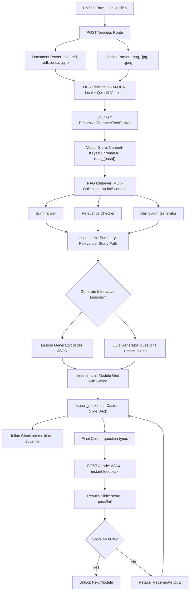

# Design and Testing Document
# Study-and-Learn

**Version:** 0.4  
**Status:** Living document  
**Last updated:** May 24, 2026

---

## 1. Architecture Overview

Study-and-Learn is a Flask web application with a Bootstrap-and-retro-CSS frontend and an AI-assisted backend workflow.

Core workflow:

1. User enters a learning goal and uploads study documents in a single unified form.
2. Backend validates and stores uploads.
3. Document parser extracts text from `.txt`, `.md`, `.pdf`, `.docx`, `.pptx`.
4. Vision parser renders pages/images and runs AI-powered OCR (GLM-OCR local, Qwen3-VL cloud) for `.png`, `.jpg`, `.jpeg`, and scanned PDFs.
5. File hashes are computed, ContentRegistry check skips duplicates globally.
6. RAG pipeline chunks, embeds, stores, and retrieves relevant context from content-keyed ChromaDB collections.
7. AI services generate summary, relevance check, and study path.
8. Results page displays structured output with improved visual hierarchy.
7. AI services generate summary, relevance check, and study path.
8. Results page displays structured output with improved visual hierarchy.
9. User clicks "Generate Interactive Lessons" to produce slide-based lessons.
10. AI generates lesson slides + inline checkpoints + mixed-type quiz per module.
11. Custom CSS/JS slide deck presents lessons with retro fonts and checkpoint blocking.
12. Learner completes quiz, receives instant grading with per-question feedback.
13. Failed modules can be retaken with fresh regenerated questions.
14. Progression is gated (80% pass threshold required to unlock next module).

---

## 2. Architecture Decisions

### ADR-001: Use Flask for the MVP

**Decision:** Use Flask for backend development.

**Reason:** Flask is lightweight, Python-based, and suitable for a capstone-scale web application. It allows fast development without imposing a large framework structure.

### ADR-002: Use Bootstrap for the UI

**Decision:** Use Bootstrap 5 for UI styling.

**Reason:** Bootstrap provides responsive layout and common UI components with minimal custom CSS and no complex frontend build process.

### ADR-003: Avoid chat UI in the MVP

**Decision:** Use forms, buttons, and structured result pages.

**Reason:** The project goal is guided learning support, not open-ended chatbot interaction. This also makes the MVP easier to test and demonstrate.

### ADR-004: Use an AI client wrapper

**Decision:** AI calls should go through a service wrapper such as `ai_client.py`.

**Reason:** This makes the application easier to test by allowing mocked AI responses. It also allows Ollama or another model provider to be swapped later.

### ADR-005: Start with simple parsing before advanced retrieval

**Decision:** Implement document parsing and whole-document/section summarization first. Add embeddings/retrieval only after the core workflow works.

**Reason:** The capstone MVP depends on end-to-end functionality. Retrieval adds value but also complexity.

### ADR-006: Implement RAG Pipeline (Chunk → Embed → Retrieve → Generate)
**Decision:** Replace direct document-to-AI prompting with LangChain chunking + ChromaDB retrieval.
**Reason:** Prevents context window overflow, enables source-grounded outputs, scales to multiple documents, and aligns with modern AI engineering standards.
**Tradeoffs:** ✅ Grounded, scalable, traceable • ❌ Adds vector DB dependency, requires embedding strategy

### ADR-007: Configurable AI Model Provider with Mock Fallback

**Decision:** AI services use an environment-variable-driven model configuration (`OLLAMA_MODEL`, `AI_BACKEND`). CI/testing uses `AI_MOCK=true`.

**Reason:** Capstone MVP prioritizes reliability over model routing complexity. A single configurable environment variable allows the developer to switch between small local models, larger local models, or cloud-based models without code changes. Mock fallback guarantees deterministic tests in CI regardless of GPU availability or network access.

**Update:** Sprint 5 introduced the `AI_BACKEND` environment variable (`local` or `cloud`) to make the provider switch explicit and testable. A `ai_client.py` smoke test validates the indirection works correctly.

### ADR-008: Separate Chat and Embedding Model Configuration

**Decision:** Chat uses `OLLAMA_MODEL`, embeddings use `OLLAMA_EMBEDDING_MODEL`.

**Reason:** Chat models typically do not expose embedding endpoints. Separating the two allows independent tuning — a smaller embedding model may suffice for retrieval while a larger chat model can be used for generation. Both are swappable via environment variables.

### ADR-009: Custom CSS/JS Slide Deck Engine (Replaces reveal.js)

**Decision:** Build a custom CSS/JS slide-deck engine instead of using reveal.js.

**Reason:** reveal.js introduced layout overflow bugs, scaling issues on the constrained viewport, and CSS conflicts with the project's retro theme (custom `@font-face` declarations, cyberpunk body styles). A custom engine gives full control over sizing, font application, checkpoint blocking logic, and responsive breakpoints. The custom engine renders slides from JSON, supports title/content/example/summary slide types, inline checkpoint blocking, and final quiz forms — all with Retrograde Bold and BoldPixels pixel fonts. This aligns with the "thin MVP" philosophy (build only what's needed) and avoids dependency bloat.

### ADR-010: Server-Side Session Storage with Flask-Session + cachelib (Phase 1); DB-Backed Lesson Repository (Phase 2)

**Decision (Phase 1):** Use Flask-Session with cachelib's FileSystemCache for session storage.

**Reason:** Flask's default signed-cookie sessions cap at ~4 KB. Full lesson JSON for 5 modules with slides, checkpoints, and quiz questions far exceeds this limit. Flask-Session's server-side storage keeps the per-request cookie small while storing large session data on disk. FileSystemCache was chosen over the deprecated filesystem backend to match Flask-Session 0.8's recommended pattern. Tradeoffs: ✅ No cookie size limits, transparent to app code • ❌ Requires `data/flask_session/` directory, sessions lost on server restart (acceptable for MVP demo).

**Decision (Phase 2 — Sprint 5):** Replace the session-backed lesson storage with a PostgreSQL-backed `LessonRepository` using `StudyPath` and `LessonProgress` models.

**Reason:** User accounts (Sprint 5) introduced persistent identity, making session-only lesson storage insufficient. A DB-backed repository (`lesson_repo.py`) persists lesson content (`StudyPath.content_data`), extracted text corpora (`StudyPath.extracted_texts`), and per-module progress (`LessonProgress` rows) across sessions and server restarts. The repository seam pattern (`get_lessons()` / `save_lessons()`) was retained so that the storage backend can be swapped again in the future without changing route logic.

**Post-Sprint 5 Update:** Multi-path support was added in Sprint 5 bug-fix rounds. Each learning goal creates an independent `StudyPath` row (via `create_study_path()`), enabling users to maintain up to 3 active study paths simultaneously. All lesson routes are path-aware (accept `path_id` query parameter), and the dashboard renders a navigable grid of all active paths with per-path progress bars. `save_lessons()` targets a specific path when `path_id` is provided; without it, falls back to the most recently created active path. Tradeoffs: ✅ Persistent across restarts, enables per-user lesson gating, multi-path navigation, progress tracking • ❌ Adds DB dependency for lesson storage, requires migration.

### ADR-011: Sequential Lesson Generation with Progress Feedback

**Decision:** Generate lessons sequentially (one module at a time) with a visible progress/loading indicator rather than concurrently.

**Reason:** Sequential execution is simpler to debug, logs clearly, avoids overwhelming the local Ollama server with concurrent requests on limited hardware (6GB VRAM), and enables accurate per-module progress reporting. Concurrency was considered but rejected due to: harder error handling, risk of Ollama request queuing and timeouts, and difficulty showing clean progress.

### ADR-013: Cachelib-Backed Progress Tracking (Replaces In-Memory Dict)

**Decision:** Use cachelib's `FileSystemCache` for progress tracking between long-running POST requests and concurrent polling GET requests. The progress key is a client-generated UUID passed as a POST body field and GET query parameter.

**Reason:** Flask-Session only persists data at request-end, making it invisible to concurrent polling. A module-level Python dict is unreliable across threads in Flask's threaded debug server. cachelib's FileSystemCache provides file-backed, thread-safe read/write with immediate visibility to all concurrent requests. Tradeoffs: ✅ Thread-safe, immediate visibility, simple API • ❌ Small disk writes every 2s during generation (acceptable for MVP).

### ADR-014: Mascot Speech Bubble as Progress Indicator

**Decision:** Merge the progress indicator into the existing mascot speech bubble rather than maintaining a separate DOM element.

**Reason:** Eliminates visual overlap between two fixed-position elements (speech bubble and progress indicator both positioned bottom-right). The mascot "speaking" the progress stage is more intuitive and engaging than a separate progress bar. The speech bubble stays persistently visible during generation (no 4-second auto-hide) and reverts to idle chatter after completion. Tradeoffs: ✅ Cleaner UI, no overlap, more engaging • ❌ Speech bubble width increased from 200px to 240px to accommodate progress bar.

### ADR-012: Retake = Regenerate Fresh Questions

**Decision:** On lesson retake, regenerate entirely new quiz questions and checkpoints rather than reusing the originals.

**Reason:** Reusing the same questions on retake allows learners to memorize answers without understanding the material — the worst pedagogical outcome. Regenerating questions each retake tests real comprehension and is pedagogically strongest. The tradeoff is additional Ollama calls and generation time per retake, but this is acceptable on a per-module basis (5 questions + ~2 checkpoints per retake, < 60 seconds each on qwen3:0.6b).

### ADR-015: Multi-Path Study Support (Independent StudyPath per Learning Goal)

**Decision:** Each learning goal processed via `POST /process` creates an independent `StudyPath` row (via `create_study_path()`), enabling up to 3 concurrent active study paths per user.

**Reason:** Sprint 5 testing revealed that the initial single-path architecture overwrote previous learning goals when a new one was processed. Multi-path support allows learners to study multiple subjects simultaneously (e.g., "Computer Science" and "Software Engineering") with independent progress tracking per subject. The dashboard renders all active paths as a navigable grid, and all lesson routes accept a `path_id` query parameter to target specific paths. The session-leak bug (user A's session data appearing for user B) was also fixed by clearing session data on login rather than logout. Tradeoffs: ✅ Multi-subject study, independent progress, cleaner UX • ❌ More DB rows, path-aware routing complexity.

### ADR-016: Admin Panel, Access Control, Password Reset, and Error Handlers

**Decision:** Add an admin-only dashboard (`/admin`), per-user lesson generation toggle, self-service password reset, admin-initiated password reset, custom HTTP error pages, and a 3-tier access model (unauthenticated / privileged / unprivileged).

**Reason:** Sprint 5 introduced user accounts but left admin functionality incomplete. Admins need a centralized view to manage user access (toggle `can_generate_lessons`, reset passwords). The access model was refined to three tiers: unauthenticated users see the login form, privileged users (`can_generate_lessons=True` or `is_admin=True`) see the full learning form, and unprivileged users see an access-denied message. Custom error handlers (400/403/404/500) provide retro-themed error pages instead of raw Werkzeug debug output. Tradeoffs: ✅ Role-based access control, user management, polished error UX • ❌ Removed dead `login.html` template (index.html handles unauthenticated login inline).

### ADR-017: AI-Powered OCR/Vision Integration with Content-Addressable Deduplication

**Decision:** Integrate local GLM-OCR (0.9B, text/table/figure recognition) and cloud Qwen3-VL:235b (figure descriptions) as an AI-powered OCR pipeline, coupled with SHA-256 content-addressable deduplication via a `ContentRegistry` database model and content-keyed ChromaDB collections (`doc_{hash}`).

**Reason:** Before Sprint 6, the app only supported text-layer extraction from `.txt`, `.md`, `.pdf`, and `.docx`. Scanned PDFs, embedded images, PowerPoint slides, and raw image files were either rejected or produced empty output. The OCR pipeline enables 8 file types, extracts text from visual content, and generates semantic figure descriptions. Content-addressable deduplication prevents redundant OCR and embedding when identical files are uploaded by different users or in different sessions — ChromaDB collections are named by file hash and shared globally rather than tied to user sessions. Tradeoffs: ✅ 8 file types, global dedup, multi-collection retrieval • ❌ Adds GLM-OCR dependency (~2.2 GB), Poppler system dependency, ~2s/page OCR latency

### ADR-018: Typed Exception Hierarchy with User-Facing Error Messages

**Decision:** Replace generic `RuntimeError` in AI clients with a typed exception hierarchy (`StudyAndLearnError` → `AIServiceError` → `AIModelUnavailableError` / `AICloudAPIError` / `AITimeoutError`), add exponential-backoff retry for transient connection failures, and catch AI errors at the service layer to return user-friendly messages instead of raw error strings.

**Reason:** Before this change, Ollama failures (connection refused, HTTP 500, timeouts) produced raw `RuntimeError` strings shown directly to users: `"Failed to reach Ollama at http://localhost:11434"`. Users had no way to distinguish between a temporary glitch (retryable) and a configuration error (needs human fix). The new hierarchy maps HTTP status codes and exception types to user-actionable messages (`"AI service is currently unavailable. Please verify your AI backend is running and try again."`). Service-layer generators (`summarizer.py`, `relevance_checker.py`, `curriculum_generator.py`) catch `AIServiceError` and either raise `StudyAndLearnError` with a friendly message or gracefully fall back to default content. Lesson/quiz generators fall back to hardcoded content when AI is unavailable rather than crashing. Silent `except Exception: pass` blocks were converted to `logger.warning()` calls. Tradeoffs: ✅ User-visible error clarity, graceful degradation, retry resilience • ❌ 7-class hierarchy, additional `try/except` in each service layer

---

## 4. Software & Architectural Patterns
- Model-View-Controller (MVC): Flask routes (Controller) delegate to `src/services/` (Model/Business Logic) and render Bootstrap templates (View). Separation keeps routing thin and services testable.
- Service Layer Pattern: All AI, parsing, and RAG logic isolated in `src/services/`. Enables independent unit testing, easy mocking, and future provider swaps.
- Repository/DAO Pattern: ChromaDB vector storage abstracted behind `vector_store.py`. Decouples ingestion from retrieval logic.
- Mock Object Pattern: `AI_MOCK=true` and in-memory ChromaDB replace live LLM/vector calls in CI. Guarantees deterministic, zero-cost, GPU-free test execution.

---

## 5. Testing Strategy

### Unit Tests
    Unit tests cover isolated logic:
    - allowed file type validation,
    - parser selection,
    - parser error handling,
    - prompt construction,
    - relevance label parsing,
    - curriculum output parsing,
    - AI client mock mode and live mode,
    - LangChain text splitter output validation,
    - ChromaDB collection creation & persistence checks,
    - ChromaDB uses EphemeralClient when CI=true, PersistentClient otherwise,
    - Similarity search context builder accuracy,
    - Multi-file upload session & cookie size limits,
    - AI calls mocked via AI_MOCK=true,
    - Lesson generator: mock, empty inputs, retriever, slide validation, fallback behavior,
    - Quiz generator: mock, empty inputs, retriever, inline checkpoint, question validation, type mix distribution, fallback quiz structure,
    - Slide validation (only known types accepted),
    - Question validation (all 4 question types: mcq, true_false, multi_select, fill_blank),
    - Fallback lesson and quiz generation for error resilience,
    - Vision parser: OCR, file hashing, content registry, dedup, feature gates, concurrent handling (20 tests),
    - Parser expansion: pptx extraction, image files, dedup verification (5 tests),
    - RAG expansion: multi-collection retrieval, metadata propagation, scores (4 tests).

### Integration Tests

Integration tests cover routes and workflow behavior:
- homepage loads,
- `/process` route with valid data returns results,
- `/process` route rejects empty goal,
- `/process` route rejects empty files,
- `/process` route rejects invalid file types,
- `/process` route enforces max 5 files,
- mocked full workflow: goal + upload → summary → relevance → study path,
- mocked generate-lessons flow: session data → lesson + quiz generation → redirect,
- lesson deck route with pre-populated session lessons returns 200.

Current test suite: **172 tests across 21 test modules covering core MVP, auth, models, dashboard, lesson repository, admin access, multi-path workflows, OCR/vision pipeline, multi-collection retrieval, and access control — 0 failures**.

### Smoke Tests

Smoke tests run before sprint demos and final recording:
- app starts,
- sample document uploads,
- summary displays with markdown rendering,
- relevance result displays with colored indicator,
- study path timeline displays,
- "Generate Interactive Lessons" button triggers generation,
- slide deck renders with retro fonts,
- checkpoints block advance until answered,
- quiz grading returns score and per-question feedback,
- retake regenerates questions,
- module gating enforces 80% pass progression.

---

## 6. CI/CD

Initial GitHub Actions workflow:

- trigger on push and pull request,
- install Python,
- install dependencies,
- run `pytest -v tests/`.

Future additions:
- linting,
- formatting,
- deployment automation,
- security scanning.

---

## 7. AI Tooling Use

AI tooling may be used to:
- refine specifications,
- draft code,
- generate test ideas,
- debug implementation issues,
- improve documentation.

All AI-generated code must be reviewed before commit. Important project behavior should be covered by tests.

---

## 8. Deployment Notes

Deployment target is undecided. Candidate platforms:
- Render,
- Railway,
- PythonAnywhere,
- DigitalOcean,
- AWS EC2.

The deployed version should be stable enough for capstone demonstration and accessible from the final submission link.

---

## 9. Deployment Strategy & Cost Analysis
- Option A: Local-First Demo (Current)
  - Host: Developer laptop running Ollama + Flask
  - Cost: $0 (uses existing hardware)
  - Tradeoff: Not publicly accessible; suitable for sprint demos & local dev
- Option B: Free-Tier Cloud (Recommended for Submission)
  - Host: Render or Railway (Flask web service)
  - Cost: $0/month (free tier supports 512MB–1GB RAM, sufficient for Flask + static assets)
  - AI Strategy: Swap Ollama for cloud API (OpenRouter/Groq) or keep `AI_MOCK=true` for demo
  - Vector DB: ChromaDB runs in-memory or uses persistent volume (~50MB free tier storage)
  - Tradeoff: Requires API key or mocked AI; free tier sleeps after inactivity but wakes on request
- Option C: VPS (DigitalOcean/AWS)
  - Cost: ~$6–12/month (4GB RAM droplet)
  - Tradeoff: Overkill for capstone; adds operational overhead
Recommendation: Deploy to Render/Railway free tier with `AI_MOCK=true` for grading, document swap path to production API in README.

---

## 10. Known Risks

| Risk | Impact | Mitigation |
|---|---|---|
| AI model too slow locally or inconsistent output quality | Demo delay or poor pedagogical value | Use small documents and cached/demo responses; support cloud model fallback via `AI_BACKEND=cloud` |
| File parsing issues | Failed workflow | Start with fewer file types and add more gradually |
| Scope creep | Missed MVP | Keep optional features outside official sprint goals |
| Deployment resource limits | App unavailable | Test deployment early; maintain `AI_MOCK=true` path for free-tier hosting without GPU |
| AI output inconsistency | Poor demo | Use controlled sample documents and structured prompts |
| PostgreSQL privilege issues on live DB | Blocked migrations | Document `init_db.sql` workaround (includes DROP IF EXISTS + full schema + seed accounts) and `GRANT CREATE` procedure |
| Session leakage between users | User A sees User B's data after logout/login swap | Fixed in Sprint 5 bug-fix rounds: clear session-scoped keys on login via `session.pop()` |
| OCR model unavailable (GLM-OCR not pulled) | OCR pipeline fails for scanned PDFs | Graceful fallback to traditional text extraction; clear warning logged |
