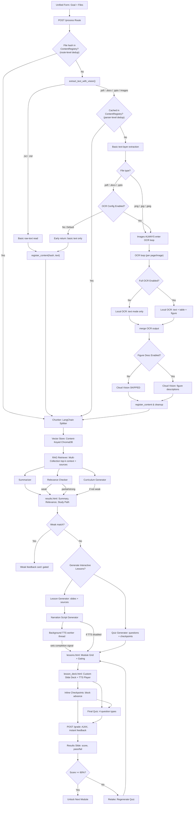

# Design and Testing Document
## Study-and-Learn Capstone Project

---

## 1. Executive Summary
**Study-and-Learn** is an AI-powered educational web application that transforms uploaded study materials (PDFs, DOCX, PPTX, images, and text) into structured, interactive learning pathways. Using a Retrieval-Augmented Generation (RAG) architecture, the system ensures that generated lessons, quizzes, and summaries are strictly grounded in the user's proprietary documents rather than the AI's general training data. 

The application features a retro-cyberpunk themed custom slide-deck engine, inline comprehension checkpoints, opt-in neural text-to-speech (TTS) narration, and global content-addressable deduplication. This document outlines the system architecture, key engineering decisions, testing strategy, and deployment configuration that guided the project from conception to a fully deployed, production-ready state.

---

## 2. High-Level Architecture
The application follows a service-oriented web architecture designed to separate HTTP routing from complex AI and document-processing logic.

*   **Frontend:** Bootstrap 5 paired with a custom CSS/JS retro-themed slide-deck engine.
*   **Backend:** Flask (Python 3.13) utilizing a strict Service Layer and Repository pattern.
*   **Data Layer:** PostgreSQL for relational data (users, study paths, progress) and ChromaDB (local or cloud) for vector storage.
*   **AI Integration:** Configurable local (Ollama) or cloud-based LLMs for summarization, curriculum generation, and OCR. A deterministic mock mode guarantees reliable offline testing.

### Core Workflow
1.  **Ingestion & Deduplication:** A user submits a learning goal and up to five files. The system computes SHA-256 hashes to bypass redundant processing for previously seen documents.
2.  **Extraction & OCR:** Text is extracted via standard parsers. If documents are scanned or image-based, an AI-powered local OCR pipeline extracts text, tables, and figures.
3.  **RAG Indexing:** Extracted text is chunked, embedded, and stored in content-addressed vector collections.
4.  **AI Analysis:** The system generates a summary and performs a relevance check. Weak matches gate further generation to save compute and prevent hallucinations.
5.  **Lesson Generation:** For valid matches, the system sequentially generates slide decks, inline checkpoints, and mixed-type quizzes. Opt-in TTS narration is generated asynchronously in a background worker.
6.  **Interactive Learning:** Learners navigate the custom slide deck. Progression is gated by an 80% pass threshold on final quizzes.

---

## 3. Architecture Diagram
*The following diagram illustrates the end-to-end processing pipeline, highlighting deduplication logic, OCR gating, and asynchronous TTS processing.*

---

## 4. Software & Architectural Patterns
*   **Model-View-Controller (MVC):** Flask routes act as thin controllers, delegating business logic to service modules and rendering Jinja/Bootstrap views.
*   **Service Layer Pattern:** All AI, parsing, and RAG logic is isolated in `src/services/`. This enables independent unit testing, easy mocking, and provider swapping.
*   **Repository / DAO Pattern:** Vector storage and database interactions are abstracted, decoupling ingestion from retrieval logic.
*   **Content-Addressable Storage:** File hashes act as primary keys for vector collections, enabling global deduplication across users.
*   **Mock Object Pattern:** Environment flags (`AI_MOCK=true`, `CI=true`) replace live LLM and vector calls in CI, guaranteeing deterministic, zero-cost, GPU-free test execution.

---

## 5. Architecture Decision Records (ADRs)

*   **ADR-001: Flask Backend.** *Decision:* Use Flask over Django/FastAPI. *Rationale:* Lightweight and Python-native, allowing rapid AI integration without heavy framework overhead.
*   **ADR-002: Bootstrap UI.** *Decision:* Use Bootstrap 5. *Rationale:* Provides responsive layouts and standard components without requiring complex frontend build tooling.
*   **ADR-003: Structured Forms over Chat UI.** *Decision:* Avoid conversational chat interfaces. *Rationale:* Guided, structured learning (forms, results pages, slide decks) is pedagogically stronger and easier to test than open-ended chatbots.
*   **ADR-004: AI Client Wrapper.** *Decision:* Route all AI calls through a centralized service wrapper. *Rationale:* Enables seamless mocking for CI/CD and allows swapping between local and cloud providers without touching route logic.
*   **ADR-005: Incremental Complexity.** *Decision:* Implement basic parsing before RAG. *Rationale:* Validates the core end-to-end workflow before introducing vector database dependencies.
*   **ADR-006: RAG Pipeline.** *Decision:* Use LangChain chunking and ChromaDB retrieval. *Rationale:* Prevents context-window overflow, grounds outputs in source material, and scales to multiple documents.
*   **ADR-007: Configurable AI Providers.** *Decision:* Use environment variables to toggle Local, Cloud, or Mock AI backends. *Rationale:* Ensures deterministic CI testing while allowing flexible deployment options.
*   **ADR-008: Separate Chat and Embedding Models.** *Decision:* Decouple chat completion models from embedding models. *Rationale:* Allows independent tuning (e.g., using a lightweight model for embeddings and a larger model for reasoning).
*   **ADR-009: Custom Slide Deck Engine.** *Decision:* Build a custom CSS/JS deck instead of using `reveal.js`. *Rationale:* Avoided severe CSS conflicts and layout overflow bugs, allowing full control over retro-theming and checkpoint blocking logic.
*   **ADR-010: DB-Backed Lesson Repository.** *Decision:* Migrate from server-side sessions to PostgreSQL for lesson storage. *Rationale:* Sessions are too small for full lesson JSON and do not persist across server restarts or multiple devices.
*   **ADR-011: Sequential Lesson Generation.** *Decision:* Generate modules sequentially rather than concurrently. *Rationale:* Prevents overwhelming local hardware/Ollama, simplifies error handling, and enables accurate progress reporting.
*   **ADR-012: Regenerate on Retake.** *Decision:* Generate fresh questions on retake. *Rationale:* Prevents answer memorization, ensuring the system tests actual comprehension.
*   **ADR-013: File-Backed Progress Tracking.** *Decision:* Use `cachelib` FileSystemCache for progress polling. *Rationale:* Provides thread-safe, immediate visibility to concurrent polling requests during long-running generation tasks.
*   **ADR-014: Mascot Speech Bubble.** *Decision:* Merge the progress bar into the mascot's CRT-styled speech bubble. *Rationale:* Eliminates UI overlap and creates a more engaging, cohesive user experience.
*   **ADR-015: Multi-Path Support.** *Decision:* Allow up to 3 concurrent study paths per user. *Rationale:* Supports realistic user behavior (studying multiple subjects) while preventing database bloat.
*   **ADR-016: 3-Tier Access Control.** *Decision:* Implement Unauthenticated, Privileged, and Admin tiers. *Rationale:* Secures lesson generation capabilities and provides administrative user management.
*   **ADR-017: AI-Powered OCR & Deduplication.** *Decision:* Integrate local GLM-OCR and SHA-256 content registry. *Rationale:* Enables processing of scanned PDFs/images while ensuring identical files uploaded globally only undergo OCR/embedding once.
*   **ADR-018: Typed Exception Hierarchy.** *Decision:* Replace generic `RuntimeError` with typed AI exceptions. *Rationale:* Allows the service layer to gracefully degrade or show user-friendly messages instead of crashing on transient network errors.
*   **ADR-019: Relevance Gating.** *Decision:* Block lesson generation on "Weak" relevance matches. *Rationale:* Saves compute tokens and prevents the AI from generating hallucinated study paths for irrelevant documents.
*   **ADR-020: Source Citation Provenance.** *Decision:* Preserve chunk metadata from retrieval to the frontend. *Rationale:* Guarantees deterministic, zero-hallucination source citations via a modal overlay.
*   **ADR-021: Dashboard Lifecycle Tabs.** *Decision:* Implement Active, Completed, and Cancelled tabs. *Rationale:* Gives users a clear view of their learning history and prevents accidental deletion of active paths.
*   **ADR-022: Per-Lesson PDF Export.** *Decision:* Use `fpdf2` for pure-Python PDF export. *Rationale:* Avoids heavy system dependencies (like GTK/WeasyPrint) while allowing learners to export individual passed modules.
*   **ADR-023: Edge-TTS Narration.** *Decision:* Use Microsoft Edge Neural voices via `edge-tts`. *Rationale:* Zero-cost, high-quality audio generation without requiring external API keys.
*   **ADR-024: Difficulty Snapshotting.** *Decision:* Inject difficulty constraints into prompts and snapshot the result. *Rationale:* Ensures retroactive changes to user settings do not corrupt or alter previously generated lessons.
*   **ADR-025: Session Save/Resume.** *Decision:* Store deck position in the lesson JSON blob. *Rationale:* Enables seamless session resume without requiring database schema migrations.
*   **ADR-026: Atomic DB Redirect Signal.** *Decision:* Replace cache-based polling redirects with an atomic DB column (`generation_completed_at`). *Rationale:* Eliminates race conditions between the HTTP request handler and background TTS workers, ensuring the user is never stranded on a loading screen.
*   **ADR-027: ChromaDB Cloud Toggle.** *Decision:* Implement a fallback-tolerant cloud toggle for vector storage. *Rationale:* Enables cloud deployment while guaranteeing the app safely reverts to local storage if cloud credentials fail.

---

## 6. Key Engineering Highlights
Beyond standard web development, this project required solving several complex distributed systems and AI-engineering challenges:

### 6.1 Global Content-Addressable Deduplication
To prevent redundant, expensive OCR and embedding operations, the system computes SHA-256 hashes of all uploaded files. These hashes map to a `ContentRegistry` and dictate the naming convention of ChromaDB collections. If User A and User B upload the same proprietary manual, the system processes it once and shares the vector index, drastically reducing latency and compute costs.

### 6.2 Source Provenance Pipeline
A major challenge in RAG systems is "lost provenance," where retrieved text is stripped of its metadata before reaching the LLM. I engineered a pipeline that preserves chunk-level metadata (source hash, filename, chunk ID) through the LangChain retriever, into the lesson JSON, and finally to the frontend. This allows the "View Sources" modal to display exact document excerpts with zero risk of LLM hallucination.

### 6.3 Asynchronous TTS & Atomic Redirects
Generating neural audio for 5+ modules can take 45–90 minutes. Running this in the HTTP request thread causes timeouts; running it in a background thread introduced severe race conditions with the frontend's polling mechanism (which relied on shared cache states). 
**The Solution:** I implemented an **Atomic Database Signal**. The background worker updates lesson statuses idempotently and sets a `generation_completed_at` timestamp in its `finally` block. The frontend polls this specific DB column via a dedicated endpoint, entirely decoupling the UI redirect logic from the volatile cache state.

### 6.4 Configuration-Gated OCR Pipeline
Running local Vision models on every PDF page is memory-prohibitive in production. I designed a multi-tiered extraction pipeline: standard text-layer extraction runs universally, while AI-powered OCR (GLM-OCR) and Cloud Figure Description (Qwen3.5) are strictly gated behind environment flags. This allows the system to gracefully degrade based on the host environment's hardware constraints.

---

## 7. Testing Strategy
The project employs a rigorous, test-driven development (TDD) approach with a suite of **445 automated tests**.

*   **Unit Tests:** Cover isolated logic including file validation, parser behavior, LangChain splitting, prompt construction, and AI client mocking.
*   **Integration Tests:** Verify end-to-end route behavior, form submissions, session management, and database transactions using an in-memory SQLite override for speed.
*   **Smoke Tests:** Manual and automated checks performed before deployment to verify the health endpoint, basic upload flows, and deck rendering.
*   **CI Isolation:** By utilizing `AI_MOCK=true` and `CI=true` (which forces ChromaDB to use an ephemeral in-memory client), the entire test suite runs deterministically in GitHub Actions without requiring GPUs, local Ollama instances, or network access.

The suite spans 36 test modules organized into three layers: unit tests that isolate individual services (parsing, RAG retrieval, prompt construction, quiz generation, TTS), integration tests that exercise route behavior and database transactions through a test client, and a single end-to-end smoke test that walks the complete learner workflow from upload through grading and retake. Every integration fixture swaps the production PostgreSQL database for an in-memory SQLite instance on a per-test basis, so the full suite runs without an external database while still validating real SQLAlchemy model behavior. Coverage grew incrementally across all eight sprints, with regression tests added alongside each production bug fix — including the Sprint 8 deployment issues (login redirect crash, TTS file-descriptor leak, missing embedding model, and the `/health` endpoint). The documented 445-test count reflects 426 explicit test functions plus parametrized mascot-animation cases that expand the effective total. All tests run deterministically in GitHub Actions with mocked AI and no network access, making the suite both free to run and reproducible across environments.

---

## 8. CI/CD & Deployment Strategy
### 8.1 CI/CD Pipeline
A 3-stage GitHub Actions workflow runs on every push to `main`:
1.  **Test:** Installs dependencies and runs the 445-test `pytest` suite.
2.  **Deploy:** SSHes into the production droplet, pulls the latest code, rebuilds the virtual environment, and restarts the `systemd` service.
3.  **Smoke-Test:** Pings the live `/health` endpoint to verify the deployment succeeded.

### 8.2 Deployment Options & Cost Analysis
| Option | Host | Cost | Trade-offs |
| :--- | :--- | :--- | :--- |
| **Option A: Local Demo** | Developer Laptop | $0 | Not publicly accessible; relies on local GPU. |
| **Option B: Cloud VPS (Selected)** | DigitalOcean (4 vCPU, 8GB RAM) | $48/mo | Always-on, public URL. Requires offloading AI/Vector to cloud to fit in 8GB RAM. |
| **Option C: Free PaaS** | Render / Railway | $0 | **Rejected.** 512MB-1GB RAM limits are insufficient for PostgreSQL + Poppler + Python stack. |

**Production Architecture:** The app is hosted on DigitalOcean, served via Gunicorn (gthread) and Nginx, with Let's Encrypt SSL. To respect the 8GB RAM limit, heavy AI inference is routed to Ollama Cloud, and vector storage is routed to Chroma Cloud, leaving the droplet to handle orchestration, DB transactions, and background TTS threading.

---

## 9. Known Risks & Mitigations
| Risk | Impact | Mitigation |
| :--- | :--- | :--- |
| **AI Output Inconsistency** | Poor pedagogical value | Strict RAG grounding; relevance gating; structured JSON prompting with fallbacks. |
| **Resource Limits (RAM)** | App crashes during OCR | Configuration-gated OCR pipeline; cloud-offloading for production. |
| **Session Leakage** | User A sees User B's data | Explicit session clearing on login; DB-backed multi-path isolation. |
| **TTS Service Dependency** | Narration fails | Graceful degradation; lessons remain 100% functional without audio. |
| **Long-Running Generation** | User stranded on loading screen | Atomic DB redirect signals; 2-hour hard timeouts; background workers. |

---

## 10. Use of AI Tools During Development
AI assistants were utilized as pair-programming tools to refine SRS specifications, draft boilerplate code, generate edge-case test ideas, and debug complex asynchronous race conditions. **All AI-generated code was strictly reviewed, tested, and refactored by the developer** to ensure alignment with the project's architectural patterns and security requirements. Critical system behaviors are fully covered by the automated test suite to prevent AI-introduced regressions.

---

## Appendix: Glossary
*   **ADR:** Architecture Decision Record.
*   **RAG:** Retrieval-Augmented Generation.
*   **GLM-OCR:** Local 0.9B parameter model for optical character recognition.
*   **Edge-TTS:** Microsoft's neural text-to-speech library.
*   **Content-Addressable:** Storage keyed by the cryptographic hash of the content itself.
